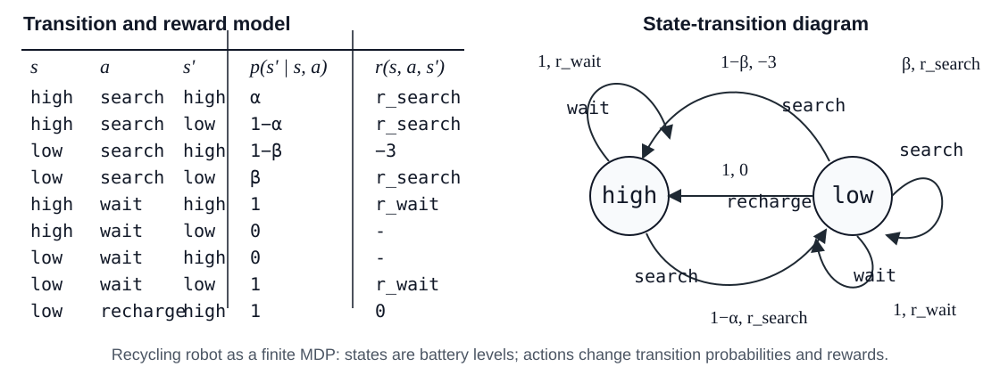

# Markov Decision Process

## 核心理解

Markov Decision Process，简称 MDP，是强化学习中最常见的决策过程建模框架。

它用状态、动作、状态转移和奖励来描述一个智能体如何与环境交互，并把“如何行动”转化为一个可以优化的数学问题。

在强化学习中，MDP 的作用是把 agent-environment interaction 形式化：

- agent 在某个状态下选择动作；
- environment 根据动作转移到下一个状态；
- environment 给出奖励；
- agent 的目标是选择一个策略，使长期累计回报最大。

因此，MDP 不是某个具体算法，而是描述强化学习问题的基础模型。

## Markov 性质

MDP 中最关键的假设是 Markov property。

它表示：给定当前状态后，未来只依赖当前状态和当前动作，而不再依赖更早的历史。

也就是说：

$$
P(S_{t+1} \mid S_t, A_t, S_{t-1}, A_{t-1}, \dots)
=
P(S_{t+1} \mid S_t, A_t)
$$

这个假设的含义是：当前状态 $S_t$ 已经包含了做决策所需的全部相关信息。

如果一个状态表示没有包含足够信息，那么它就可能不满足 Markov 性质。

## MDP 的组成

一个 MDP 通常可以写成五元组：

$$
(\mathcal{S}, \mathcal{A}, P, R, \gamma)
$$

其中：

- $\mathcal{S}$ 是状态空间，表示所有可能状态的集合。
- $\mathcal{A}$ 是动作空间，表示所有可能动作的集合。
- $P$ 是状态转移概率，描述在状态 $s$ 下执行动作 $a$ 后转移到状态 $s'$ 的概率。
- $R$ 是奖励函数，描述某次状态转移或动作选择能获得多少即时奖励。
- $\gamma$ 是折扣因子，用来平衡即时奖励和未来奖励。

## 状态转移概率

状态转移概率描述 environment 如何响应 agent 的动作。

通常写成：

$$
P(s' \mid s, a)
$$

它表示：当前处于状态 $s$，执行动作 $a$ 后，下一个状态变成 $s'$ 的概率。

如果 environment 是确定性的，那么某个 $(s, a)$ 通常只会对应一个确定的下一个状态。

如果 environment 是随机的，那么同一个状态和动作可能导致多个不同的下一个状态，每个结果有不同概率。

## 奖励函数

奖励函数描述 agent 在某次交互中得到的即时反馈。

常见写法包括：

$$
R(s, a)
$$

或：

$$
R(s, a, s')
$$

前者表示奖励只由当前状态和动作决定。

后者表示奖励还依赖转移后的下一个状态。

奖励函数定义了“什么行为是好的”。强化学习算法并不是直接知道任务目标，而是通过奖励信号间接学习策略。

## 折扣因子

折扣因子 $\gamma$ 控制未来奖励的重要性，通常满足：

$$
0 \le \gamma \le 1
$$

如果 $\gamma$ 接近 0，agent 更关注眼前奖励。

如果 $\gamma$ 接近 1，agent 更重视长期回报。

长期累计回报通常写成：

$$
G_t
=
R_{t+1}
+
\gamma R_{t+2}
+
\gamma^2 R_{t+3}
+
\cdots
$$

也可以写成：

$$
G_t
=
\sum_{k=0}^{\infty}
\gamma^k R_{t+k+1}
$$

这个公式表达的是：越远的未来奖励会被乘上越高次的 $\gamma$。

## Recycling Robot 示例

Recycling Robot 是一个经典的强化学习示例，用来展示如何把一个看似复杂的真实任务转化为有限 MDP。

例子设定在办公室环境中：一个移动机器人负责收集空汽水罐。它配备传感器用于探测罐子，配备机械臂和抓取器用于拾取罐子并放入车载回收箱，同时还依赖可充电电池工作。

机器人内部可以有感知模块、导航模块和操作模块，但在最高层次上，强化学习 agent 只负责决定如何搜索罐子。这个高层决策主要依据当前电池电量。

### 状态空间与动作空间

为简化建模，机器人只有两种电量状态：

$$
\mathcal{S} = \{high, low\}
$$

在高电量状态下，可选动作是：

$$
\mathcal{A}(high) = \{search, wait\}
$$

这里不考虑 `recharge`，因为电量充足时充电没有意义。

在低电量状态下，可选动作是：

$$
\mathcal{A}(low) = \{search, wait, recharge\}
$$

此时机器人可以继续搜索、等待别人带来罐子，或者返回基站充电。

这个例子体现了 state-dependent action sets：不同状态下可执行动作可以不同。

### 奖励结构

奖励信号体现了任务目标：

- 大部分时间奖励为 0。
- 找到罐子时获得正奖励。
- 电池耗尽并必须等待救援时获得大负奖励。

在这个环境中，`search` 通常更有效率，但会消耗电量；`wait` 更安全，但收益较低；`recharge` 短期没有直接收益，但可以避免电池耗尽带来的灾难性惩罚。

### 状态转移概率

状态变化具有随机性，可以用两个关键参数描述。

当电量高时选择 `search`：

- 以概率 $\alpha$ 保持高电量；
- 以概率 $1-\alpha$ 降为低电量。

当电量低时选择 `search`：

- 以概率 $\beta$ 保持低电量；
- 以概率 $1-\beta$ 电量耗尽并进入需要救援的坏结果。

这部分对应 MDP 中的转移模型：

$$
p(s' \mid s, a)
$$

它把环境中的不确定性编码进状态转移概率中。

### 建模启示

Recycling Robot 说明，MDP 建模的关键不是模拟现实系统的所有物理细节，而是选择合适的抽象层次。

在这个例子中，不需要模拟电流、电压或电池化学过程，只需要把电量抽象成 `high` 和 `low`，就能构成一个可计算、可分析的有限 MDP。

这个例子还说明：

- 状态定义决定 agent 能看到什么信息。
- 动作定义决定 agent 能直接控制什么。
- 奖励定义决定学习目标。
- 转移概率定义 environment 如何响应动作。

一旦 state、action、reward 和 transition 被定义清楚，强化学习问题就可以进入策略评估、价值函数和策略优化等后续问题。

## MDP 与 k-armed Bandit 的关系

k-armed Bandit Problem 可以看作 MDP 的简化版本。

它没有复杂的状态转移，或者可以理解为只有一个状态。

bandit 问题主要关注：

- 在多个动作之间如何选择；
- 如何平衡 exploration 和 exploitation；
- 如何根据即时奖励估计动作价值。

完整 MDP 则进一步引入状态和状态转移，使当前动作会影响未来状态，也会影响后续可获得的奖励。

因此，MDP 比 bandit 更适合描述序列决策问题。

## 与相关节点的关系

- `Reinforcement Learning` 通常用 MDP 形式化 agent 与 environment 的交互。
- `k-armed Bandit Problem` 可以看作没有复杂状态转移的简化 MDP。
- `Policy` 描述 MDP 中 agent 如何选择动作。
- `Value Function` 描述在 MDP 中状态或动作的长期价值。
- `Q-Learning` 通过学习动作价值函数来求解 MDP。
- `Dynamic Programming` 可以在已知转移模型时求解 MDP。

## 子节点

- [Bellman Equation](bellman-equation/index.md)

## 待整理

- Policy：状态到动作的选择规则。
- Value Function：状态或动作的长期价值。
- State Transition：环境状态如何变化。
- Discount Factor：未来奖励折扣系数。
- Return：从某一步开始的累计回报。
